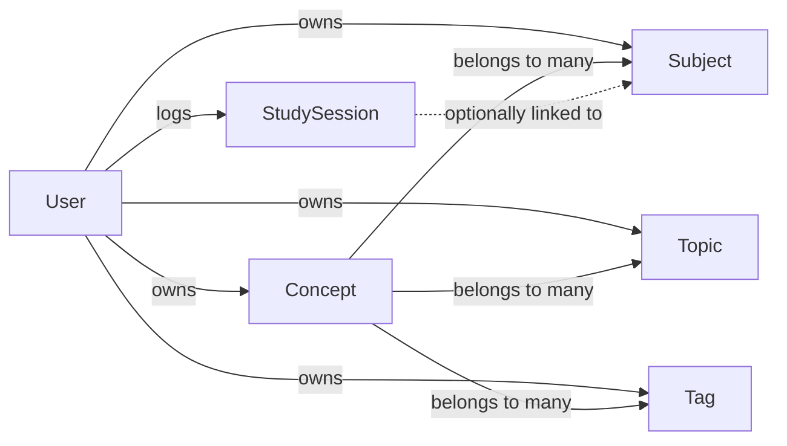
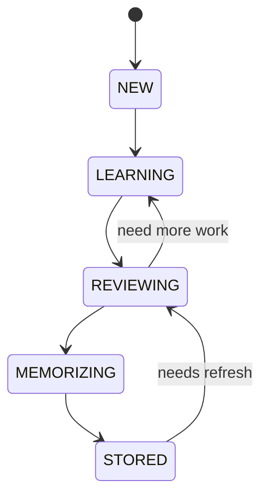

# 01 — System Overview

## What Is TortugaIQ?

TortugaIQ is a personal knowledge management system designed for **long-term retention**, not memorization drills. The central insight is that most learning tools (flashcards, spaced repetition) optimize for short-term recall tests. TortugaIQ instead asks: what is the smallest, most useful way to represent something you want to permanently own?

The core unit of the app is the **Concept**: a named piece of knowledge with three layers:

| Layer | Field | Purpose |
|-------|-------|---------|
| MVK | `mvkNotes` | Minimum Viable Knowledge — the smallest useful summary |
| Notes | `markdownNotes` | Full explanation with examples, diagrams, math |
| References | `referencesMarkdown` | Links, papers, sources |

Users do NOT get quiz prompts. They navigate manually, track their own progress, and use states and review counts to signal mastery to themselves.

---

## The Domain Model



### Entity Descriptions

**Concept** — the main entity. Has a name, three text content fields, a state enum, priority enum, review count, and a pinned flag.

**Subject** — a broad category (e.g., "Machine Learning", "Mathematics"). Concepts belong to multiple subjects. Subjects have custom sort orders and sort mode preferences.

**Topic** — a more granular grouping (e.g., "Gradient Descent", "Linear Algebra"). Cross-cuts subjects. A concept on "backpropagation" might be in subject "Machine Learning" and topic "Gradient Descent".

**Tag** — freeform labels (e.g., "important", "needs-review"). No hierarchy.

**StudySession** — a log entry: how many minutes the user studied, optionally linked to a subject.

### Concept Lifecycle (State Machine)



States: `NEW` → `LEARNING` → `REVIEWING` → `MEMORIZING` → `STORED`

These are **manual** — the user decides when to advance. There is no algorithm.

---

## Tech Stack

### The Full Stack at a Glance

| Layer | Technology | Version |
|-------|-----------|---------|
| Framework | Next.js (App Router) | 16.2.2 |
| Language | TypeScript | 5 (strict) |
| Database | PostgreSQL via Neon | serverless |
| ORM | Drizzle ORM + Drizzle Kit | 0.45.2 |
| Authentication | Auth.js v5 (NextAuth) | 5.0.0-beta.30 |
| Client data cache | TanStack Query | 5.96.2 |
| Validation | Zod | 4.3.6 |
| Styling | Tailwind CSS v4 | 4 |
| Markdown | react-markdown + remark-gfm + remark-math + rehype-katex | — |
| Diagrams | Mermaid | 11.14.0 |
| Email | Resend | 6.10.0 |
| Hosting | Vercel | — |
| Icons | Lucide React | — |
| Password hashing | bcryptjs | 3.0.3 |

---

## Why Each Technology Was Chosen

### Next.js (instead of Vite + separate Spring Boot API)

The biggest architectural decision. The original Vite demo had a React SPA frontend and would have needed a separate backend API. Next.js collapses this:

- **Server Actions** replace REST endpoints — instead of writing a Spring Boot `@RestController`, you write a TypeScript function marked `'use server'` in the same codebase
- **File-system routing** replaces React Router configuration
- **Server Components** render on the server, so initial page loads arrive as full HTML (better performance, better SEO)
- **One deployment** — the entire app deploys to Vercel as a single unit; no coordinating a backend and frontend separately

The tradeoff: Next.js has a learning curve for developers coming from SPA patterns (React + Vite). Server Components, layouts, and the distinction between server/client code take time to internalize. See [02 — Next.js Deep Dive](./02-nextjs-deep-dive.md).

### PostgreSQL on Neon (instead of SQLite or another managed DB)

- **PostgreSQL** was chosen over SQLite because: multi-user app, production-grade reliability, proper constraint enforcement (unique indexes, foreign keys with cascade), full SQL power
- **Neon** specifically was chosen because: serverless-native (scales to zero, no idle cost on Vercel's hobby tier), **branch support** (create isolated dev/staging copies of the DB), seamless Vercel integration (one-click DATABASE_URL injection)

### Drizzle ORM (instead of Prisma)

Both are TypeScript ORMs for Node.js. The decision came down to:

| | Drizzle | Prisma |
|--|---------|--------|
| Schema definition | TypeScript code | `.prisma` file (own DSL) |
| Type inference | From schema directly | Requires codegen step |
| Query style | SQL-like builder | Feels more like an ORM |
| Bundle size | Smaller, less magic | Heavier |
| Raw SQL access | Easy, first-class | Possible but awkward |

Drizzle felt closer to writing SQL (which aligns with a Java/Spring developer's mental model) and avoided a codegen step in the build pipeline.

### Auth.js v5 (instead of building from scratch)

OAuth 2.0 (Google, Facebook) requires handling redirect flows, token exchange, PKCE, state parameters, and secure storage — dozens of edge cases. Auth.js handles all of this. Think of it like Spring Security's OAuth2 auto-configuration: you configure providers, it handles the plumbing.

The v5 (beta) was chosen because it works natively with Next.js App Router and Server Actions. The stable v4 has App Router friction.

### TanStack Query (instead of Redux or plain fetch)

After a user loads their concepts, they stay in the browser's memory and don't need to be re-fetched every time a component mounts. TanStack Query is a **server-state cache**: it fetches from the server, stores the result, and serves it from cache on subsequent requests — refetching in the background when data gets stale.

This is different from:
- **Redux**: general application state (TQ is specifically for async server data)
- **useState + useEffect + fetch**: works but you have to implement caching, deduplication, background refresh, loading/error states, and optimistic updates yourself — TQ gives all of this for free

### Zod (instead of manual validation or class-validator)

Zod validates data **at runtime** and produces **TypeScript types** from the same schema definition. This means:

```typescript
const conceptInputSchema = z.object({
  name: z.string().min(1).max(200),
  subjectNames: z.array(z.string()),
  // ...
})

// TypeScript knows the shape from the schema — no duplication:
type ConceptInput = z.infer<typeof conceptInputSchema>
```

In Spring Boot, you'd use `@NotNull`, `@Size`, `@Valid` annotations on a DTO class. The Zod equivalent is less verbose and the type is automatically correct.

### Tailwind CSS v4 (instead of CSS modules or styled-components)

Utility-first CSS: instead of writing `.container { display: flex; gap: 8px; }`, you write `className="flex gap-2"` directly in JSX. The tradeoffs:

- **Pro**: No CSS files to maintain, no naming conflicts, styles co-located with markup, consistent spacing/color scale
- **Con**: Class lists can get long; less clear separation of concerns

Tailwind v4 is configured via CSS imports (no `tailwind.config.ts`) which is a breaking change from v3. This app has no `tailwind.config.ts` — configuration is done in `src/app/globals.css`.

### Resend (instead of nodemailer)

Resend is a transactional email service (like SendGrid or Mailgun). It's used for password reset emails only. The alternative — nodemailer — requires configuring an SMTP server yourself. Resend provides a simple `POST` API, good deliverability, and free tier for low volume.

---

## Evolution of the App

The app started as a **Vite + React demo** — a frontend-only prototype to validate the concept. It had no database, no auth, and no persistence.

It was then rebuilt as a **Next.js production application** in a single repo, keeping the same UI ideas but replacing the entire architecture underneath. This is why the `docs/updates/` folder contains `demo-v2.x.md` files — those describe the Vite-era feature progression, and `docs/production-planning/` documents describe the transition plan.

The production app was built feature by feature:
1. Auth (credentials + Google + Facebook)
2. Core concept CRUD (create, read, update, delete)
3. Subjects, topics, tags (with M:M relationships)
4. Multiple view modes (Library, Focus, Index)
5. Study session tracking
6. MVK drawer and keyboard navigation
7. Guest user system
8. Custom sort orders for subjects
9. Landing page + blog

At the time of this documentation, the app is at **v1** — a complete, production-ready product.

---

## Structural Decisions Worth Knowing

**No API routes for domain data.** All data mutations go through Server Actions, not HTTP endpoints. The only API routes are `/api/auth/[...nextauth]` (required by Auth.js) and `/api/cleanup-guests` (the Vercel cron target).

**No image storage.** The `tiq-img://` scheme is reserved but not implemented. Images are intentionally excluded to keep the app simple and avoid S3/CDN complexity.

**No SRS algorithm.** The review count and state fields exist for user self-tracking only. There is no scheduling algorithm, no due dates, no queue.

**Orphan pruning.** When you remove a subject from a concept and no other concept references that subject, the subject is automatically deleted. This keeps the taxonomy clean without requiring users to manually manage it.
