# 02 — Next.js Deep Dive

This document is written specifically for someone who knows React well but is new to Next.js. If you've been building React SPAs with Vite, much of this will feel familiar — with some important differences that change how you think about the request/response lifecycle.

---

## What Next.js Adds to React

React is a **UI library** — it renders components and manages state. It says nothing about routing, data fetching, server-side rendering, or deployment.

Next.js is a **framework built on React** that adds:

| Concern | Vite + React (SPA) | Next.js (App Router) |
|---------|--------------------|----------------------|
| Routing | React Router (client-side) | File-system routing (URL = folder structure) |
| Data fetching | fetch() in useEffect | Server Components fetch directly; no useEffect needed |
| Server code | Separate API server (Spring Boot, Express) | Server Actions + API Routes in same repo |
| Initial page load | Empty HTML shell + JS bundle | Full HTML from server (SSR) |
| SEO | Poor (crawler sees empty shell) | Good (full HTML on first load) |
| Bundle size | All code ships to browser | Only client components ship to browser |

The key mental shift: **in Next.js, some of your code runs on the server and some runs in the browser**, and this distinction matters.

---

## The App Router

Next.js has two routing systems. This app uses the **App Router** (introduced in Next.js 13, now the standard). Forget the Pages Router — it's legacy.

### File-System Routing

The URL is determined by the folder structure under `src/app/`:

```
src/app/
├── page.tsx                          → /
├── (app)/app/
│   ├── page.tsx                      → /app
│   ├── concepts/[conceptId]/
│   │   └── page.tsx                  → /app/concepts/abc123
│   ├── library/
│   │   └── page.tsx                  → /app/library
│   └── subjects/[subjectId]/
│       └── page.tsx                  → /app/subjects/xyz789
├── (auth)/
│   ├── sign-in/page.tsx              → /sign-in
│   └── sign-up/page.tsx             → /sign-up
└── (marketing)/
    └── notes/[slug]/page.tsx         → /notes/my-post
```

**Special file names with reserved meanings:**

| File | Purpose |
|------|---------|
| `page.tsx` | The UI for a route — what the user sees |
| `layout.tsx` | Wraps pages; persists across navigations in the same route group |
| `loading.tsx` | Shown while the page is loading (React Suspense fallback) |
| `error.tsx` | Shown when a page throws an error (error boundary) |
| `not-found.tsx` | 404 page |
| `route.ts` | API endpoint (replaces Express route handler) |

### Route Groups (The Parentheses)

Folders with parentheses like `(app)`, `(auth)`, and `(marketing)` are **route groups**. They organize routes logically WITHOUT affecting the URL. The URL for `(app)/app/library/page.tsx` is `/app/library` — the `(app)` folder name is invisible to the URL.

Why use them? To apply different **layouts** to different sections:
- `(app)` routes get the full app shell: sidebar, study bar, all providers
- `(auth)` routes get a minimal centered layout (just a form)
- `(marketing)` routes get an empty wrapper (public content)

---

## Server Components vs. Client Components

This is the most important concept to understand.

### Server Components (the default)

Every component is a **Server Component by default** unless you add `'use client'` at the top.

Server Components:
- **Run only on the server** — the browser never sees this code
- **Can access the database directly** — no API call needed
- **Cannot use hooks** (no useState, no useEffect, no useContext)
- **Cannot handle browser events** (no onClick, no onChange)
- Produce HTML that is sent to the browser

Think of a Server Component like a Thymeleaf template or JSP rendered by Spring MVC — the data is fetched on the server, merged with the template, and sent as HTML.

```typescript
// src/app/(app)/app/overview/page.tsx — Server Component
// Note: no 'use client' at the top

import { auth } from '@/auth'
import { getConcepts } from '@/actions/concepts'

export default async function OverviewPage() {
  const session = await auth()         // Access session directly on server
  const concepts = await getConcepts() // Direct server action call, no fetch()

  return (
    <div>
      <h1>Welcome, {session?.user?.name}</h1>
      <p>You have {concepts.length} concepts</p>
    </div>
  )
}
```

### Client Components

Add `'use client'` at the top to make a Client Component.

Client Components:
- **Run in the browser** (and also run once on the server for the initial HTML — "hydration")
- **Can use all React hooks** (useState, useEffect, useContext, etc.)
- **Can handle browser events** (onClick, onChange, etc.)
- **Cannot directly access the database** — they must call a Server Action or API route

Think of a Client Component like a regular React component in a Vite app.

```typescript
'use client'

import { useState } from 'react'
import { useConcepts } from '@/hooks/useConcepts'

export function ConceptList() {
  const { data: concepts } = useConcepts() // TanStack Query hook
  const [search, setSearch] = useState('')

  return (
    <input value={search} onChange={(e) => setSearch(e.target.value)} />
    // ... render filtered concepts
  )
}
```

### The Rule: Push `'use client'` Down the Tree

A common mistake is marking entire pages as `'use client'`. The better approach: keep the page as a Server Component (fetch data on the server), and make only the **interactive leaf components** client components.

```
page.tsx (Server Component — fetches data)
└── ConceptListWrapper (Server Component — passes data as props)
    └── ConceptRow (Client Component — handles click, keyboard)
        └── PinButton (Client Component — handles toggle)
```

This minimizes the JavaScript bundle sent to the browser.

---

## Layouts and Nesting

Layouts wrap pages and persist across navigations. They are powerful but can be confusing.

### How Layouts Stack

```
src/app/layout.tsx               ← Root layout (always active)
└── src/app/(app)/layout.tsx     ← App shell layout (active for /app/* routes)
    └── src/app/(app)/app/       ← No layout here — page renders directly
        └── library/page.tsx     ← The actual page
```

When you navigate from `/app/library` to `/app/concepts/abc123`, the root layout and the `(app)` layout **stay mounted** — only the page component swaps out. This is why the sidebar doesn't re-render on navigation.

### Root Layout (`src/app/layout.tsx`)

Wraps the entire app. This is where global providers live:

```typescript
// src/app/layout.tsx
export default function RootLayout({ children }) {
  return (
    <html lang="en">
      <body>
        <SessionProvider>      {/* NextAuth session context */}
          <QueryProvider>      {/* TanStack Query client */}
            {children}
          </QueryProvider>
        </SessionProvider>
      </body>
    </html>
  )
}
```

### App Layout (`src/app/(app)/layout.tsx`)

This is the app shell — it's a Client Component because it manages sidebar state, listens to route changes, and renders interactive UI:

```typescript
'use client'
// src/app/(app)/layout.tsx

export default function AppLayout({ children }) {
  return (
    <DirtyStateProvider>
      <ViewStateRegistryProvider>
        <ConceptFormProvider>
          <AppShellInner>
            {/* Sidebar, StudySessionBar, main content */}
            {children}
          </AppShellInner>
        </ConceptFormProvider>
      </ViewStateRegistryProvider>
    </DirtyStateProvider>
  )
}
```

The provider nesting order is intentional — see [07 — State & Providers](./07-state-and-providers.md).

---

## The Full Route Map

```mermaid
graph TD
    ROOT["/ (root layout)"]
    
    ROOT --> LANDING["/  — Landing Page"]
    ROOT --> AUTH["(auth) layout — centered form"]
    ROOT --> APP["(app) layout — full app shell"]
    ROOT --> MKT["(marketing) layout — public"]
    ROOT --> API["/api — API routes"]

    AUTH --> SIGNIN["/sign-in"]
    AUTH --> SIGNUP["/sign-up"]
    AUTH --> FORGOT["/forgot-password"]
    AUTH --> RESET["/forgot-password/reset"]

    APP --> HOME["/app — Home"]
    APP --> LIBRARY["/app/library — Library"]
    APP --> FOCUS["/app/focus — Focus Mode"]
    APP --> INDEX["/app/index — Index Mode"]
    APP --> OVERVIEW["/app/overview — Overview"]
    APP --> SESSIONS["/app/sessions — Sessions"]
    APP --> CONCEPT["/app/concepts/[id] — Concept View"]
    APP --> SUBJECT["/app/subjects/[id] — Subject View"]

    MKT --> NOTES["/notes — Blog List"]
    MKT --> POST["/notes/[slug] — Blog Post"]
    MKT --> PRIVACY["/privacy — Privacy Policy"]

    API --> NEXTAUTH["/api/auth/[...nextauth] — OAuth handlers"]
    API --> CRON["/api/cleanup-guests — Cron endpoint"]
```



---

## Middleware

`src/middleware.ts` runs **before every matching request**, on the Vercel **Edge** (not a regular serverless function — it's a lightweight V8 isolate that starts faster).

```typescript
// src/middleware.ts
import { auth } from '@/auth'
import { NextResponse } from 'next/server'

export default auth((req) => {
  const isLoggedIn = !!req.auth
  const isAppRoute = req.nextUrl.pathname.startsWith('/app')
  const isAuthRoute = req.nextUrl.pathname.startsWith('/sign-in') ||
    req.nextUrl.pathname.startsWith('/sign-up')

  // Rule 1: /app/* requires authentication
  if (isAppRoute && !isLoggedIn) {
    const signInUrl = new URL('/sign-in', req.nextUrl.origin)
    signInUrl.searchParams.set('callbackUrl', req.nextUrl.pathname)
    return NextResponse.redirect(signInUrl)
  }

  // Rule 2: Authenticated non-guest users don't need /sign-in or /sign-up
  const isGuest = req.auth?.user?.isGuest === true
  if (isAuthRoute && isLoggedIn && !isGuest) {
    return NextResponse.redirect(new URL('/app', req.nextUrl.origin))
  }

  return NextResponse.next()
})

// Only run on these paths — other routes skip middleware entirely
export const config = {
  matcher: ['/app/:path*', '/sign-in', '/sign-up'],
}
```

**Key behaviors:**
1. Unauthenticated user hits `/app/library` → redirect to `/sign-in?callbackUrl=/app/library`
2. After login, `/sign-in` reads `callbackUrl` and redirects to original destination
3. Authenticated (non-guest) user hits `/sign-in` → redirect to `/app`
4. Guest users can access `/sign-in` (to convert their account to a permanent one)
5. `/notes`, `/privacy`, `/api/*` — no middleware runs at all

---

## API Routes

API Routes in Next.js App Router are `route.ts` files. This app has only two — everything else uses Server Actions.

### `/api/auth/[...nextauth]/route.ts`

Required by Auth.js. The `[...nextauth]` is a **catch-all route** — it handles all OAuth callbacks:
- `/api/auth/signin/google` — initiates Google OAuth
- `/api/auth/callback/google` — handles Google's redirect back
- `/api/auth/signout` — logs out
- etc.

You never write code in this file — Auth.js generates all handlers from your `src/auth.ts` configuration.

### `/api/cleanup-guests/route.ts`

A regular HTTP endpoint called by Vercel Cron daily. It deletes guest users older than 30 days. It requires a `CRON_SECRET` header for security. See [10 — Deployment](./10-deployment.md).

---

## Server Actions

Server Actions are the biggest innovation in the App Router. They deserve their own document ([05 — Server Actions](./05-server-actions.md)), but here's the core concept:

```typescript
// src/actions/concepts.ts
'use server'

export async function createConcept(input: ConceptInput): Promise<string> {
  const session = await auth()
  if (!session?.user?.id) throw new Error('Unauthorized')
  // ... insert to DB
  return newConceptId
}
```

This function has `'use server'` at the top of the file. When a Client Component imports and calls it:

```typescript
'use client'
import { createConcept } from '@/actions/concepts'

// This looks like a function call — but Next.js serializes it as a POST request
await createConcept({ name: 'Backpropagation', subjectNames: ['ML'] })
```

Next.js automatically:
1. Serializes the arguments to JSON
2. POSTs to a special internal endpoint (`/_next/action`)
3. Runs the function on the server
4. Returns the result

No `fetch()`. No URL. No `@PostMapping`. The function boundary IS the API.

---

## Spring Boot → Next.js Mental Model

For developers coming from Java/Spring Boot, this table maps familiar concepts:

| Spring Boot | Next.js Equivalent |
|-------------|-------------------|
| `@SpringBootApplication` (entry point) | `src/app/layout.tsx` (root layout) |
| `@RestController` + `@GetMapping` | `page.tsx` (Server Component) |
| `@PostMapping("/api/concepts")` | `export async function createConcept()` with `'use server'` |
| `@Service` bean | Server Action function |
| `@Repository` + JPA | Drizzle ORM `db.query.*` |
| `@Entity` class | `pgTable()` in `schema.ts` |
| `@Valid` + Bean Validation | `zodSchema.parse(input)` |
| `HttpSession` / `SecurityContext` | `await auth()` returns the session |
| `OncePerRequestFilter` | `src/middleware.ts` |
| `application.properties` | `.env.local` + Vercel environment variables |
| Thymeleaf template | Server Component returning JSX |
| React component with state | Client Component (`'use client'`) |

---

## Dynamic Routes and Params

Square brackets in folder names create dynamic routes:

```
src/app/(app)/app/concepts/[conceptId]/page.tsx
```

The page receives `params.conceptId`:

```typescript
// Server Component — params available directly
export default async function ConceptPage({
  params,
}: {
  params: { conceptId: string }
}) {
  const concept = await getConcept(params.conceptId)
  // ...
}
```

In Client Components, use `useParams()` hook from `'next/navigation'`.

---

## Navigation

In Next.js App Router, use the `useRouter` hook (from `'next/navigation'`, NOT from `'next/router'` — that's the old Pages Router):

```typescript
'use client'
import { useRouter } from 'next/navigation'

function MyComponent() {
  const router = useRouter()
  router.push('/app/library')  // Navigate programmatically
  router.back()               // Go back
}
```

For links in JSX, use Next.js's `<Link>` component instead of `<a>`:

```typescript
import Link from 'next/link'

<Link href="/app/library">Go to Library</Link>
```

`<Link>` prefetches the destination when it enters the viewport, making navigation feel instant.
