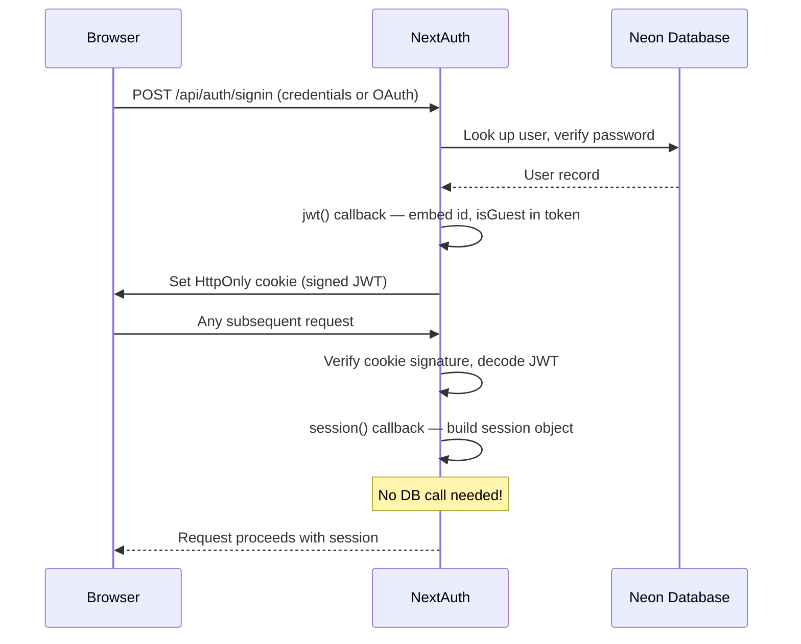
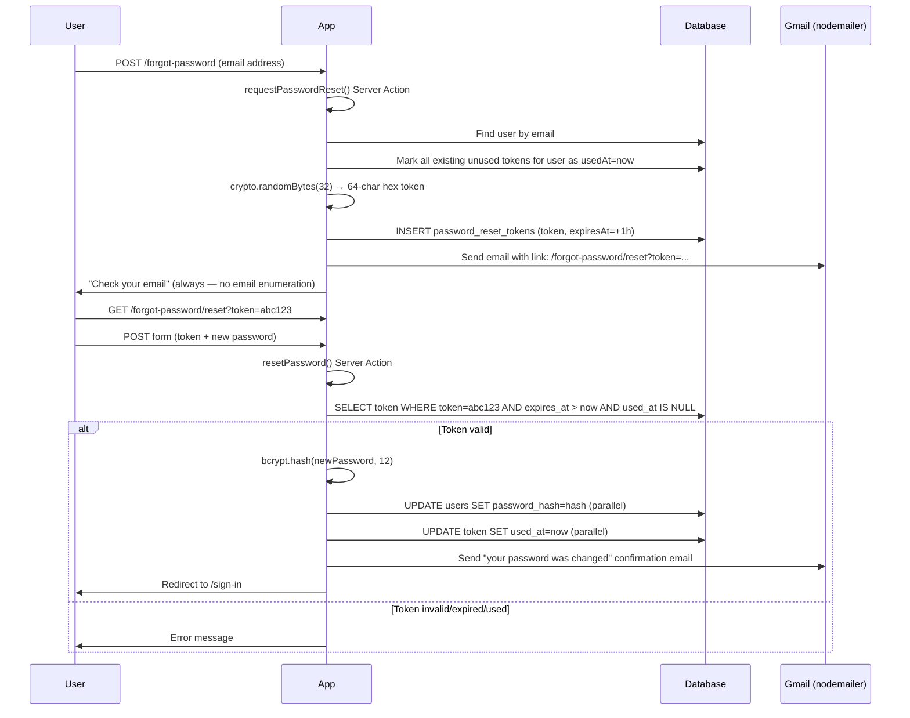

# 04 — Authentication

## Overview

Authentication is handled by **Auth.js v5** (formerly NextAuth.js). It manages:
- Sign-in via Google OAuth
- Sign-in via Facebook OAuth
- Sign-in via email + password (Credentials provider)
- JWT-based session storage
- Guest (demo) accounts with 30-day TTL

Think of Auth.js as Spring Security's OAuth2 auto-configuration: you declare which providers you want and configure a few callbacks, and Auth.js handles the OAuth flows, token exchange, session cookies, and database adapter work.

---

## Session Strategy: JWT (Not Database Sessions)

Auth.js supports two session strategies:

| Strategy | How Sessions Work | DB Read on Request? |
|----------|------------------|---------------------|
| `database` | Session token stored in `sessions` table; every request looks it up | Yes — every request |
| `jwt` | Session data stored in a signed, encrypted cookie | No — cookie is self-contained |

This app uses **`jwt`** strategy (`session: { strategy: 'jwt' }` in `src/auth.ts`).

### Why JWT?

1. **Lower latency**: No database roundtrip on every page load or Server Action call
2. **Guest data in the token**: `isGuest` and `guestCreatedAt` are embedded in the JWT payload — the guest banner knows the TTL without querying the DB
3. **Simpler scaling**: Stateless sessions work across multiple server instances automatically

### How JWT Sessions Work



The JWT is stored as an **HttpOnly cookie** — JavaScript cannot read it. Only the server can access it via the Auth.js `auth()` function.

---

## Auth.js Configuration (`src/auth.ts`)

```typescript
export const { handlers, signIn, signOut, auth } = NextAuth({
  adapter: DrizzleAdapter(db, {
    usersTable: users,
    accountsTable: accounts,
    sessionsTable: sessions,
    verificationTokensTable: verificationTokens,
  }),
  session: { strategy: 'jwt' },
  providers: [ Google(...), Facebook(...), Credentials(...) ],
  pages: { signIn: '/sign-in', error: '/sign-in' },
  callbacks: { jwt(...), session(...) },
})
```

The exported values are:
- **`handlers`** — HTTP handlers for `/api/auth/[...nextauth]/route.ts`
- **`signIn` / `signOut`** — Server Action helpers for programmatic auth
- **`auth`** — The session accessor function; called in Server Components, Server Actions, and Middleware

### The Drizzle Adapter

The adapter bridges Auth.js's internal operations to your actual database tables. When Auth.js needs to create a user or look up an OAuth account, it calls the adapter which runs Drizzle queries.

```typescript
DrizzleAdapter(db, {
  usersTable: users,         // our users table
  accountsTable: accounts,   // our accounts table
  sessionsTable: sessions,   // our sessions table (unused for JWT, but required)
  verificationTokensTable: verificationTokens,
})
```

Without the adapter, Auth.js wouldn't know about your database schema. You pass your Drizzle table references so the adapter generates correct queries.

### TypeScript Session Extension

By default, `session.user` only has `name`, `email`, and `image`. The app extends it to include `id`, `isGuest`, and `guestCreatedAt` via TypeScript **declaration merging**:

```typescript
declare module 'next-auth' {
  interface Session {
    user: {
      id: string
      isGuest: boolean
      guestCreatedAt?: number   // epoch ms; only present for guest accounts
    } & DefaultSession['user']  // keeps name, email, image
  }
  interface User {
    isGuest?: boolean
    createdAt?: Date
  }
}
```

This tells TypeScript that `session.user.id` is always a string — so you don't get type errors when accessing it in Server Actions.

---

## The Three Providers

### 1. Google OAuth

```typescript
Google({
  clientId: process.env.GOOGLE_CLIENT_ID!,
  clientSecret: process.env.GOOGLE_CLIENT_SECRET!,
})
```

The full OAuth 2.0 flow when a user clicks "Sign in with Google":

```mermaid
sequenceDiagram
    participant User as Browser
    participant App as TortugaIQ (Vercel)
    participant Google

    User->>App: Click "Sign in with Google"
    App->>User: Redirect to Google OAuth URL
    Note over App: Includes state param, redirect_uri, scopes
    User->>Google: User logs into Google + grants permission
    Google->>App: Redirect back to /api/auth/callback/google?code=...&state=...
    App->>Google: Exchange code for tokens (server-to-server)
    Google-->>App: access_token, id_token
    App->>App: Decode id_token → user's email, name, picture
    App->>DB: Upsert user row; create accounts row linking to Google
    App->>User: Set JWT cookie; redirect to /app
```

Google requires you to configure the callback URL in Google Cloud Console:
`https://yourdomain.com/api/auth/callback/google`

### 2. Facebook OAuth

Same pattern as Google. Configured in Facebook Developer App:
`https://yourdomain.com/api/auth/callback/facebook`

### 3. Credentials Provider

The custom email + password flow:

```typescript
Credentials({
  credentials: {
    email: { label: 'Email', type: 'email' },
    password: { label: 'Password', type: 'password' },
  },
  async authorize(credentials) {
    if (!credentials?.email || !credentials?.password) return null

    // 1. Look up user by email (case-insensitive)
    const user = await db.query.users.findFirst({
      where: eq(users.email, (credentials.email as string).toLowerCase()),
    })

    // 2. User doesn't exist or is OAuth-only (no password hash)
    if (!user?.passwordHash) return null

    // 3. Compare submitted password against stored bcrypt hash
    const valid = await bcrypt.compare(
      credentials.password as string,
      user.passwordHash
    )

    if (!valid) return null

    // 4. Return user object — Auth.js embeds this in the JWT
    return {
      id: user.id,
      email: user.email,
      name: user.name,
      isGuest: user.isGuest,
      createdAt: user.createdAt,
    }
  },
})
```

Note: `authorize()` returns `null` for any failure (wrong email, wrong password, OAuth-only account). Auth.js translates `null` into a sign-in error. **We never reveal whether the email exists** — both "email not found" and "wrong password" return the same null response.

---

## JWT and Session Callbacks

These two callbacks are the bridge between Auth.js's internal state and your application's session object.

```typescript
callbacks: {
  // Called when a JWT is created or updated
  jwt({ token, user }) {
    // 'user' is only present on initial sign-in, not on subsequent requests
    if (user?.id) {
      token.sub = user.id  // 'sub' is the standard JWT subject claim
    }
    if (user !== undefined) {
      token.isGuest = user.isGuest ?? false
      if (user.isGuest) {
        token.guestCreatedAt = user.createdAt?.getTime()  // epoch ms
      }
    }
    return token
  },

  // Called every time session data is accessed
  session({ session, token }) {
    if (session.user && token.sub) {
      session.user.id = token.sub     // Expose user ID on session object
    }
    session.user.isGuest = token.isGuest ?? false
    if (token.guestCreatedAt) {
      session.user.guestCreatedAt = token.guestCreatedAt
    }
    return session
  },
},
```

**Data flow:**
```
sign-in → authorize() returns User → jwt() callback stores in token cookie
every request → session() callback reads token → builds session.user
Server Action calls auth() → gets session → accesses session.user.id
```

---

## Accessing the Session

### In Server Components and Server Actions

```typescript
import { auth } from '@/auth'

// In a Server Component (page.tsx)
export default async function MyPage() {
  const session = await auth()
  if (!session?.user?.id) redirect('/sign-in')
  // session.user.id is the authenticated user's ID
}

// In a Server Action (src/actions/concepts.ts)
export async function getConcepts() {
  'use server'
  const session = await auth()
  if (!session?.user?.id) throw new Error('Unauthorized')
  const userId = session.user.id
  // ... query DB with userId
}
```

### In Client Components

```typescript
'use client'
import { useSession } from 'next-auth/react'

function UserBadge() {
  const { data: session, status } = useSession()
  if (status === 'loading') return <Spinner />
  if (!session) return null
  return <span>{session.user.name}</span>
}
```

`useSession()` reads from the `SessionProvider` context (set up in the root layout). It does not make a network call — it reads the session data already embedded in the page by Next.js.

---

## Password Hashing

Passwords are hashed with **bcryptjs** at **12 rounds** (cost factor).

```typescript
// Sign-up: hash before storing
const hash = await bcrypt.hash(password, 12)
await db.insert(users).values({ email, name, passwordHash: hash })

// Sign-in: compare submitted password to stored hash
const valid = await bcrypt.compare(submittedPassword, storedHash)
```

### Why 12 Rounds?

bcrypt uses a cost factor to tune how long hashing takes. Higher = slower = harder for attackers to brute-force if they steal the hash database.

- 10 rounds ≈ 10ms per hash (fine for 2012 hardware, easy to brute-force on 2025 GPUs)
- 12 rounds ≈ 40ms per hash (good balance for 2025)
- 14 rounds ≈ 160ms per hash (noticeably slow UX on sign-in)

12 rounds is the current best-practice default.

---

## Password Reset Flow

The password reset flow uses a **secure one-time token** instead of email verification, because: a) we never verified the email at sign-up, and b) token-based reset is simpler and sufficient.



**Security properties:**
- Token is 32 random bytes = 256 bits of entropy (unfeasible to guess)
- 1-hour expiry limits window of opportunity
- `usedAt` prevents replay attacks (token works only once)
- No email enumeration: "check your email" is shown regardless of whether the email exists
- Old unused tokens are invalidated when a new reset is requested — a user cannot accumulate multiple valid reset windows
- Confirmation email alerts the user after a successful reset; if the change was unauthorized, they know immediately

---

## Guest User System

The guest system lets users try the app without creating an account.

### How It Works

```typescript
// src/actions/auth.ts
export async function createGuestUser() {
  const uuid = crypto.randomUUID()
  const email = `guest-${uuid}@demo.tortugaiq.com`
  const password = crypto.randomUUID()  // random, user never sees it

  await db.insert(users).values({
    email,
    name: 'Demo Guest',
    passwordHash: await bcrypt.hash(password, 12),
    isGuest: true,
  })

  return { email, password }
}
```

**Client flow** (`src/components/landing/GuestLink.tsx`):
1. User clicks "Try as Guest" on landing page
2. `createGuestUser()` is called → returns `{ email, password }`
3. Credentials are stored in `localStorage` (for return visits)
4. `signIn('credentials', { email, password })` is called → standard JWT login

On return visits, `GuestLink.tsx` checks localStorage for existing guest credentials. If found and not expired (30 days), it signs in automatically — the user doesn't have to create a new guest account.

### Guest Security

- Guest accounts have the **exact same data isolation** as regular accounts. `isGuest: true` does not grant any additional privileges or special data access.
- The JWT contains `guestCreatedAt` (epoch ms). The guest banner in the app shell calculates "days remaining" from this value — no extra DB call needed.
- Guests can access `/sign-in` to convert their account. Because the middleware allows authenticated guests through to auth pages, they can sign up with Google/email while their guest data is still accessible.

### Automatic Cleanup

A Vercel Cron job runs daily at 03:00 UTC, calling `/api/cleanup-guests`:

```typescript
// src/app/api/cleanup-guests/route.ts
const thirtyDaysAgo = new Date(Date.now() - 30 * 24 * 60 * 60 * 1000)

await db.delete(users).where(
  and(
    eq(users.isGuest, true),
    lt(users.createdAt, thirtyDaysAgo)
  )
)
```

Because `users` has `ON DELETE CASCADE` on all related tables, deleting the user row automatically deletes all their concepts, subjects, topics, tags, and sessions. Clean.

---

## Middleware Route Protection

See [02 — Next.js Deep Dive](./02-nextjs-deep-dive.md#middleware) for the full middleware code. Summary:

| Scenario | Outcome |
|----------|---------|
| Unauthenticated → `/app/*` | Redirect to `/sign-in?callbackUrl=/app/...` |
| Authenticated (non-guest) → `/sign-in` or `/sign-up` | Redirect to `/app` |
| Authenticated guest → `/sign-in` | Allowed through (can convert account) |
| Any user → `/notes`, `/privacy`, `/api/*` | No middleware runs |
