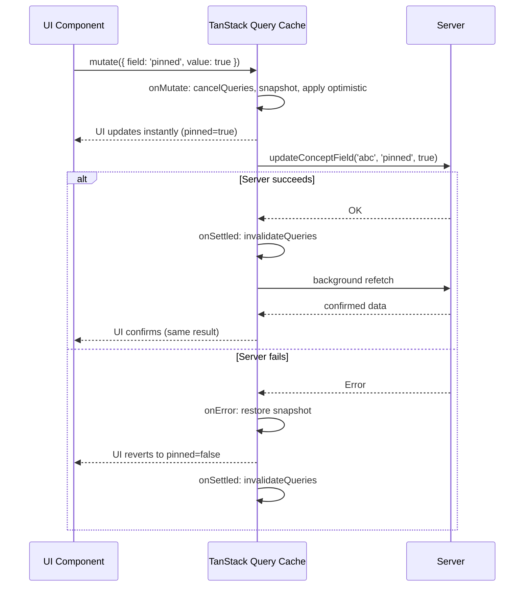

# 06 — Client Data Layer (TanStack Query)

## What Is TanStack Query?

TanStack Query (formerly React Query) is a **server-state management library** for React. It solves a specific problem: how do you fetch data from the server, cache it in the browser, keep it fresh, and synchronize it across components?

### Server State vs. Application State

This distinction is important:

| Type | What It Is | Managed By |
|------|-----------|-----------|
| **Application state** | UI state: which modal is open, sidebar collapsed, form values | `useState`, Context (React) |
| **Server state** | Data that lives in the DB: your concepts, subjects, sessions | TanStack Query |

Server state has unique properties: it's asynchronous, it can become stale, multiple components might need the same data, and you need to keep the UI in sync after mutations.

### Why Not Redux?

Redux is a general-purpose state manager. For server data, you'd have to implement:
- Loading / error states
- Cache invalidation
- Background refetching
- Optimistic updates
- Deduplication of parallel requests

TanStack Query gives all of this for free.

### Why Not Plain `useEffect` + `fetch`?

```typescript
// The naive approach — you'd have to implement all of this yourself:
const [concepts, setConcepts] = useState([])
const [loading, setLoading] = useState(true)
const [error, setError] = useState(null)

useEffect(() => {
  fetch('/api/concepts')
    .then(r => r.json())
    .then(data => setConcepts(data))
    .catch(setError)
    .finally(() => setLoading(false))
}, []) // But when do you refetch? How do you invalidate after a mutation?
```

TanStack Query replaces this entire pattern with a single `useQuery` call that handles caching, deduplication, background refresh, and error/loading states.

---

## Configuration

```typescript
// src/components/providers/QueryProvider.tsx
'use client'

import { QueryClient, QueryClientProvider } from '@tanstack/react-query'
import { useState } from 'react'

export function QueryProvider({ children }: { children: React.ReactNode }) {
  const [queryClient] = useState(
    () => new QueryClient({
      defaultOptions: {
        queries: {
          staleTime: 30_000,            // Data stays "fresh" for 30 seconds
          refetchOnWindowFocus: false,  // Don't refetch when user switches tabs
        },
      },
    })
  )

  return (
    <QueryClientProvider client={queryClient}>
      {children}
    </QueryClientProvider>
  )
}
```

**`staleTime: 30_000`** means: after fetching, don't fetch again for 30 seconds. If a component mounts and the data was fetched 15 seconds ago, it uses the cached version without a new network request.

**`refetchOnWindowFocus: false`** prevents TanStack Query from refetching every time the user returns to the browser tab. This would be disruptive in an app where users often switch between the app and reference material.

---

## Query Keys

Query keys are the identifiers for cache slots. They are arrays:

```typescript
['concepts']              // The full concept list
['concepts', 'abc123']    // A single concept with ID 'abc123'
['subjects']              // All subjects with concept counts
['topics']                // All topics
['tags']                  // All tags
['study-sessions']        // All study sessions
['subject-sort-mode', subjectId]    // Sort mode for a specific subject
['subject-concept-order', subjectId] // Custom order for a specific subject
```

Invalidating `['concepts']` marks the full list as stale. Invalidating `['concepts', id]` marks only that concept's detail cache as stale.

---

## The Hook Inventory

### `useConcepts()` — Query Hook

```typescript
export function useConcepts() {
  return useQuery<Concept[]>({
    queryKey: ['concepts'],
    queryFn: () => getConcepts(),  // calls the Server Action
  })
}
```

Usage:
```typescript
const { data: concepts, isLoading, error } = useConcepts()
```

### `useConcept(id)` — Query Hook with Cache Seeding

This hook demonstrates an important optimization: **initialData seeding**.

```typescript
export function useConcept(id: string) {
  const qc = useQueryClient()

  return useQuery<Concept | null>({
    queryKey: ['concepts', id],
    queryFn: () => getConcept(id),
    enabled: !!id,

    // Instead of showing a loading spinner when navigating from Library to ConceptView,
    // immediately populate from the list cache. The network request still runs in the
    // background to get the full names (subjectNames, topicNames, tagNames).
    initialData: () => {
      const list = qc.getQueryData<Concept[]>(['concepts'])
      const concept = list?.find((c) => c.id === id)
      if (!concept) return undefined

      // Also resolve names from the taxonomy caches
      const allSubjects = qc.getQueryData<{ id: string; name: string }[]>(['subjects']) ?? []
      const allTopics   = qc.getQueryData<{ id: string; name: string }[]>(['topics']) ?? []
      const allTags     = qc.getQueryData<{ id: string; name: string }[]>(['tags']) ?? []

      return {
        ...concept,
        subjectNames: allSubjects
          .filter((s) => concept.subjectIds.includes(s.id))
          .map((s) => s.name),
        // ...
      }
    },
    initialDataUpdatedAt: () => qc.getQueryState(['concepts'])?.dataUpdatedAt,
  })
}
```

Without `initialData`: you navigate to ConceptView → spinner → data loads → concept renders.
With `initialData`: you navigate to ConceptView → concept renders immediately from cache → background fetch silently updates if stale.

### `useSubjects()`, `useTopics()`, `useTags()` — Taxonomy Queries

Simple queries for the full lists of subjects, topics, tags. Used by ConceptForm's multi-selects and by ConceptView to resolve names.

### `useSubjectSortMode(subjectId)` and `useSetSubjectSortMode()`

Fetches and updates the sort mode for a specific subject.

### `useSubjectConceptOrder(subjectId)` and `useMoveConceptInSubject()`

Fetches and updates the custom concept order within a subject.

### `useStudySessions()`, `useAddStudySession()`, `useUpdateStudySession()`, `useDeleteStudySession()`

Study session CRUD with optimistic updates on update and delete.

---

## Mutation Hooks

Mutations are how you update data. Every mutation hook follows the same structure:

```typescript
useMutation({
  mutationFn: (input) => someServerAction(input),  // the actual server call
  onMutate,    // called before the server call (for optimistic updates)
  onError,     // called if the server call fails (for rollback)
  onSuccess,   // called on success (for additional logic)
  onSettled,   // called regardless of success/failure (for invalidation)
})
```

---

## Optimistic Updates — The Full Pattern

An **optimistic update** immediately applies the expected result to the UI cache before the server confirms it. If the server fails, the UI is rolled back.

This makes the app feel instant — clicking "pin" immediately shows the pin state, without waiting for a server roundtrip.

Here is the complete pattern from `useUpdateConceptField()`:

```typescript
export function useUpdateConceptField() {
  const qc = useQueryClient()

  return useMutation({
    mutationFn: ({ id, field, value }) => updateConceptField(id, field, value),

    // Step 1: Before the server call, update the cache optimistically
    onMutate: async ({ id, field, value }) => {
      // Cancel any in-flight refetches to avoid them overwriting our optimistic update
      await qc.cancelQueries({ queryKey: ['concepts'] })

      // Snapshot the current data so we can roll back if needed
      const prev = qc.getQueryData<Concept[]>(['concepts'])

      // Apply the optimistic change to the cache
      qc.setQueryData<Concept[]>(['concepts'], (old) =>
        old?.map((c) =>
          c.id === id ? { ...c, [field]: value } : c
        ) ?? []
      )

      // Return the snapshot as context (passed to onError)
      return { prev }
    },

    // Step 2: If the server call fails, restore the original data
    onError: (err, variables, ctx) => {
      if (ctx?.prev) {
        qc.setQueryData(['concepts'], ctx.prev)
      }
    },

    // Step 3: Whether success or failure, invalidate to get the real server state
    onSettled: () => {
      qc.invalidateQueries({ queryKey: ['concepts'] })
    },
  })
}
```

### Why Each Step Matters

**`cancelQueries` in `onMutate`:** If a background refetch is in progress when the mutation starts, the refetch could complete and overwrite your optimistic update before the mutation server response arrives. Cancelling prevents this.

**Snapshot + `onError` rollback:** If the server rejects the mutation (network error, validation error, etc.), the user would see the wrong state. Restoring the snapshot reverts the UI.

**`invalidateQueries` in `onSettled`:** Marks the cache as stale, triggering a background refetch to get the true server state. This ensures the cache eventually reflects server reality, even if our optimistic prediction was slightly off.

### Visual Flow



---

## The `refetchType: 'none'` Trick

After `createConcept`, the app navigates to the new concept's detail page. There's a subtle race condition:

1. `createConcept()` succeeds
2. `onSuccess` calls `qc.invalidateQueries(['concepts'])` — this starts a refetch network request
3. The app calls `router.push('/app/concepts/newId')` — Next.js starts an RSC navigation
4. The refetch response arrives mid-navigation — TanStack Query's `useSyncExternalStore` fires a high-priority React update
5. This React update **interrupts** Next.js's `startTransition`-wrapped navigation — the page change is silently cancelled

The fix is `refetchType: 'none'`:

```typescript
onSuccess: () => {
  // Mark as stale WITHOUT starting a network request.
  // The data will refetch automatically on next component mount.
  qc.invalidateQueries({ queryKey: ['concepts'], refetchType: 'none' })
  qc.invalidateQueries({ queryKey: ['subjects'], refetchType: 'none' })
  qc.invalidateQueries({ queryKey: ['topics'], refetchType: 'none' })
  qc.invalidateQueries({ queryKey: ['tags'], refetchType: 'none' })
}
```

This marks the queries as stale (so they'll refetch when ConceptView mounts) without triggering an immediate network request that could interfere with navigation.

This is a hard-won solution — see `docs/bugs/redirect-new-concept-navigation.md` for the full 9-attempt history of solving this race.

---

## Invalidation Strategy

After each mutation, the following query keys are invalidated:

| Mutation | Invalidates |
|----------|------------|
| `createConcept` | `['concepts']`, `['subjects']`, `['topics']`, `['tags']` (with `refetchType: 'none'`) |
| `updateConcept` | `['concepts']`, `['concepts', id]`, `['subjects']`, `['topics']`, `['tags']` |
| `deleteConcept` | `['concepts']`, `['subjects']`, `['topics']`, `['tags']` |
| `updateConceptField` | `['concepts']` (via `onSettled`) |
| `updateConceptContent` | `['concepts', id]` (with `refetchType: 'none'`) |
| `incrementReview` / `decrementReview` | `['concepts']` (via `onSettled`) |
| `createStudySession` | `['study-sessions']` |
| `updateStudySession` | `['study-sessions']` (via `onSettled`) |
| `deleteStudySession` | `['study-sessions']` (via `onSettled`) |
| `setSubjectSortMode` | `['subject-sort-mode', subjectId]`, `['subject-concept-order', subjectId]` |
| `moveConceptInSubject` | `['subject-concept-order', subjectId]` |

Subjects/topics/tags are invalidated after concept create/update/delete because `resolveOrCreate` and `pruneOrphans` may add or remove taxonomy items.

---

## `useFilterSort` — Client-Side Filtering

The `useFilterSort` hook (`src/hooks/useFilterSort.ts`) handles filtering and sorting concepts entirely on the client — no server call on each filter change.

```typescript
export function useFilterSort(concepts: Concept[], options?: UseFilterSortOptions) {
  const [filters, setFiltersState] = useState<ActiveFilters>({
    subjectIds: [], topicIds: [], tagIds: [],
    states: [], priorities: [],
    pinned: false,
  })
  const [sort, setSortState] = useState<SubjectSortMode>(
    options?.initialSort ?? 'alpha'
  )

  const filtered = useMemo(() => {
    let result = filterConcepts(concepts, filters)
    result = sortConcepts(result, sort, customOrder)
    return result
  }, [concepts, filters, sort, customOrder])

  return { filtered, filters, sort, setFilter, setSort, clearFilters, hasActiveFilters }
}
```

`useMemo` is key here — it only recomputes when the dependencies change. If only the selected concept changes (not the filter), filtering doesn't re-run.

The hook is used by SubjectView, ListMode, and FocusMode. It returns the filtered concept list and the state/setters needed to drive the FilterSortBar component.
