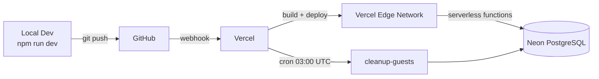
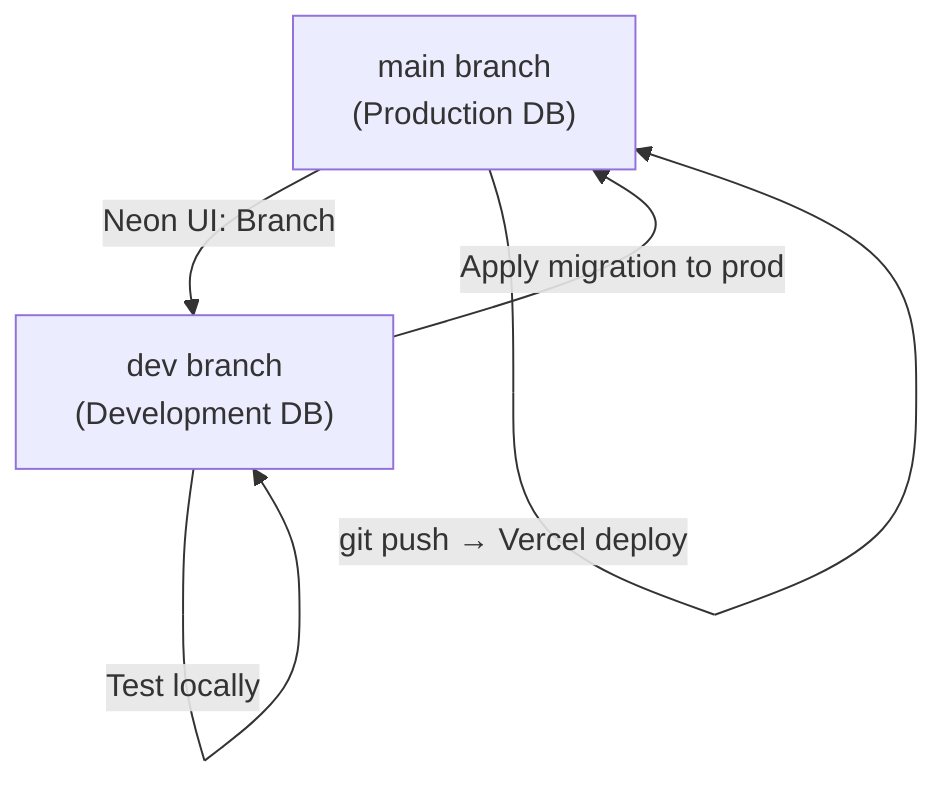
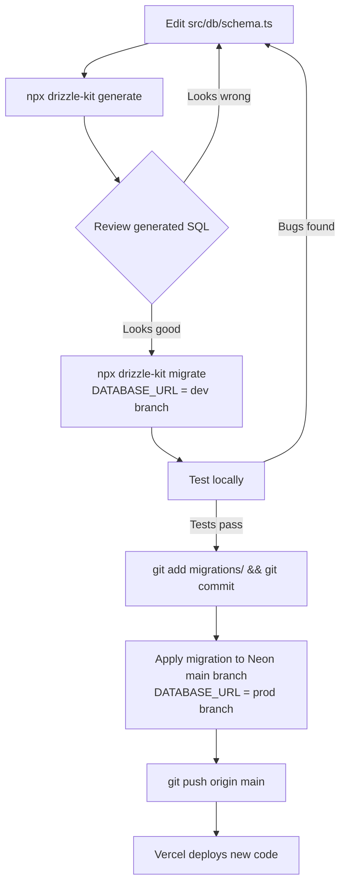

# 10 — Deployment

## Overview

TortugaIQ is deployed on **Vercel** (frontend + serverless backend) connected to **Neon** (PostgreSQL database). This combination was chosen because both are optimized for the same serverless architecture and integrate directly.



---

## Vercel

Vercel is the company that created Next.js. Their platform is optimized for Next.js deployments.

### What Vercel Does

**Build pipeline:**
1. Receives your `git push` via GitHub webhook
2. Installs dependencies (`npm install`)
3. Runs `next build` — compiles TypeScript, bundles client components, generates static assets
4. Deploys the result

**Runtime infrastructure:**
- **Server Components and Server Actions** → AWS Lambda functions (serverless). Each is isolated, stateless, and auto-scales.
- **Static assets** (images, JS bundles, fonts) → Vercel's CDN, served from the edge closest to the user
- **Middleware** → Vercel Edge Runtime (V8 isolate, starts in ~0ms, runs before the Lambda)

### Serverless Function Model

Each Server Action and API route runs as a **serverless function** — a Lambda-like compute unit that:
- Starts on demand (no idle servers)
- Auto-scales (100 simultaneous users = 100 function instances)
- Terminates after the request completes

This is why Neon's connection pooling matters: each function invocation opens a new DB connection. Without pooling, you'd exhaust PostgreSQL's connection limit quickly.

### Deploy Process

Every `git push` to the `main` branch triggers a production deployment:

```bash
git add .
git commit -m "your message"
git push origin main
# → Vercel webhook fires → build starts → deploys in ~2 minutes
```

Preview deployments are created for every pull request (if you use PRs). They get their own URL like `https://tortugaiq-git-feature-xyz.vercel.app`.

---

## Neon — Serverless PostgreSQL

### Architecture

Neon separates **compute** (PostgreSQL engine) from **storage** (the actual data files). This enables:
- **Instant branching**: a new branch doesn't copy the data — it copies a pointer to the same storage pages
- **Scale to zero**: compute pauses when idle; storage persists cheaply
- **Fast resume**: compute restarts in milliseconds (the first query after a pause is ~500ms slower)

### Pooled vs Direct Connection

| Connection Type | URL format | Use for |
|----------------|-----------|---------|
| Pooled (PgBouncer) | `postgresql://...pooler.us-east-2.aws.neon.tech/neondb?pgbouncer=true` | Application (Vercel functions) |
| Direct | `postgresql://...us-east-2.aws.neon.tech/neondb` | Migrations (`drizzle-kit migrate`) |

Vercel functions must use the pooled URL because each function opens its own connection. The pooler reuses connections behind the scenes.

Drizzle Kit migrations should use the direct URL because PgBouncer doesn't support the DDL transaction mode that migrations require.

### Neon Branching Strategy



The `dev` branch is a fork of `main` at a point in time. You apply migrations there first, test locally, then apply the same migration to `main` before deploying.

---

## Environment Variables

Set in Vercel project settings (Production + Preview environments):

| Variable | What It Is | Where To Get It |
|----------|-----------|-----------------|
| `DATABASE_URL` | Neon pooled connection string | Neon console → Connection Details → Pooled |
| `AUTH_SECRET` | JWT signing key (random 32+ chars) | `openssl rand -base64 32` |
| `AUTH_URL` | Public URL of the app | `https://yourdomain.com` |
| `GOOGLE_CLIENT_ID` | Google OAuth app client ID | Google Cloud Console → Credentials |
| `GOOGLE_CLIENT_SECRET` | Google OAuth app secret | Google Cloud Console → Credentials |
| `FACEBOOK_CLIENT_ID` | Facebook app ID | Facebook Developer Dashboard |
| `FACEBOOK_CLIENT_SECRET` | Facebook app secret | Facebook Developer Dashboard |
| `RESEND_API_KEY` | Resend API key | Resend dashboard → API Keys |
| `RESEND_FROM_EMAIL` | Verified sender email — must be on a domain verified in Resend | e.g. `noreply@yourdomain.com` |
| `CRON_SECRET` | Secret for cron endpoint auth | `openssl rand -base64 32` |

Local development: copy these to `.env.local` (never commit this file).

---

## OAuth Configuration

### Google OAuth Setup

1. Go to [Google Cloud Console](https://console.cloud.google.com) → APIs & Services → Credentials
2. Create an OAuth 2.0 Client ID (type: Web application)
3. Add authorized redirect URI: `https://yourdomain.com/api/auth/callback/google`
4. Add `http://localhost:3000/api/auth/callback/google` for local development
5. Copy Client ID and Client Secret to environment variables

### Facebook OAuth Setup

1. Go to [Facebook Developer Dashboard](https://developers.facebook.com)
2. Create a new app → Consumer
3. Add Facebook Login product
4. Add Valid OAuth Redirect URI: `https://yourdomain.com/api/auth/callback/facebook`
5. Copy App ID and App Secret to environment variables

---

## First Deploy Checklist

Follow these steps exactly to deploy from scratch:

```bash
# 1. Create Neon project
# → Neon console → New Project
# → Copy the DATABASE_URL (pooled connection string)

# 2. Apply migrations to Neon (DO THIS BEFORE DEPLOYING CODE)
DATABASE_URL=postgresql://neon-main-url npx drizzle-kit migrate
# This creates all the tables. Without this, the app crashes on first request.

# 3. Create Vercel project
# → vercel.com → New Project → Import from GitHub
# → Set root directory: leave empty (repo root)
# → Framework preset: Next.js (auto-detected)

# 4. Set all environment variables in Vercel
# → Project Settings → Environment Variables
# → Add all 10 variables listed above

# 5. Deploy
git push origin main
# → Vercel builds and deploys automatically

# 6. Configure OAuth callback URLs
# → In Google Cloud Console: add your Vercel URL
# → In Facebook Dashboard: add your Vercel URL

# 7. Test
# → Visit your app URL
# → Try sign-up, sign-in, create a concept
```

---

## Migration Workflow (Safe Path for Schema Changes)



### Step-by-Step

```bash
# 1. Modify src/db/schema.ts

# 2. Generate migration file
npx drizzle-kit generate
# → Creates src/db/migrations/0004_something.sql

# 3. Review the SQL — make sure it's what you intended
cat src/db/migrations/0004_something.sql

# 4. Apply to dev branch (your .env.local DATABASE_URL points to dev)
npx drizzle-kit migrate

# 5. Test locally
npm run dev
# Verify the feature works, check for errors

# 6. Commit the migration file
git add src/db/migrations/0004_something.sql src/db/migrations/meta/
git commit -m "migration: add some_column to some_table"

# 7. Apply to production (temporarily override DATABASE_URL)
$env:DATABASE_URL = "postgresql://neon-main-branch-url"
npx drizzle-kit migrate
# Reset DATABASE_URL back to dev branch after

# 8. Deploy
git push origin main
```

### Migration Safety Rules

- **Always generate, never push**: `drizzle-kit push` has no rollback and no history
- **Commit migration files to git**: they are the authoritative record of schema history
- **Apply to prod BEFORE deploying code**: if your code expects a new column, apply the migration first. Vercel deploys take ~2 minutes — if old code runs against a new schema, it should be safe. If new code runs against an old schema, it crashes.
- **Additive changes are safest**: adding columns with defaults, adding tables. Dropping columns/tables requires a two-step process (deploy code that doesn't use the column, then drop it).

---

## Vercel Cron Job

Defined in `vercel.json`:

```json
{
  "crons": [
    {
      "path": "/api/cleanup-guests",
      "schedule": "0 3 * * *"
    }
  ]
}
```

- `"0 3 * * *"` is cron syntax for "3:00 AM UTC every day"
- Vercel sends a `GET` request to `/api/cleanup-guests` with the `Authorization: Bearer {CRON_SECRET}` header
- The endpoint deletes all users where `is_guest = true AND created_at < now() - 30 days`
- Because `users` has `ON DELETE CASCADE` on all child tables, this also deletes all their concepts, sessions, subjects, topics, and tags

### Cron Limits

On Vercel's free tier, cron jobs are limited to once per day. On Pro, you can run more frequently. For TortugaIQ's use case (daily cleanup), once per day is sufficient.

---

## Zero-Downtime Deployments

Vercel handles zero-downtime deployments automatically:
1. New build completes in the background
2. When ready, Vercel atomically switches traffic to the new deployment
3. Old instances finish their in-flight requests, then terminate

The consequence: for a brief window during deploy, both old and new code may be running. Your database schema must be backward-compatible with the previous code version during this window.

**Safe migration pattern:**
1. Deploy code that works with BOTH old and new schema (tolerant of the new column not existing yet)
2. Run migration
3. Deploy code that requires the new column

For simple changes (adding a nullable column or a new table), this extra step isn't needed — old code simply ignores the new column.

---

## Monitoring and Logging

Current state (v1):
- **Vercel function logs**: available in the Vercel dashboard. `console.log` in Server Actions appears here. Retained for 1 hour on free tier.
- **Build logs**: full build output in Vercel dashboard.
- **Error boundaries**: `src/app/(app)/error.tsx` and `src/app/global-error.tsx` catch render errors and show a friendly page instead of crashing.

What could be added in the future:
- **Sentry** for error tracking and stack traces
- **Vercel Analytics** for real user performance monitoring
- **Logtail or Axiom** for persistent structured logging (free tier logs expire)
- **Uptime monitoring** (e.g., BetterUptime) to alert on outages

---

## Static Blog

The blog posts in `src/posts/*.md` are read at request time using Node.js `fs` (not at build time). This means adding a new post only requires deploying new markdown files — no schema change or DB interaction.

`src/lib/posts.ts` reads and parses the markdown files:
```typescript
import fs from 'fs'
import path from 'path'
import matter from 'gray-matter'  // parses YAML frontmatter

const postsDir = path.join(process.cwd(), 'src/posts')

export function getAllPosts() {
  return fs.readdirSync(postsDir)
    .filter(f => f.endsWith('.md'))
    .map(filename => {
      const raw = fs.readFileSync(path.join(postsDir, filename), 'utf8')
      const { data, content } = matter(raw)
      return { slug: filename.replace('.md', ''), ...data, content }
    })
    .sort((a, b) => new Date(b.date) - new Date(a.date))
}
```

The blog views (`/notes` and `/notes/[slug]`) are Server Components — they read the files on the server and render HTML. No client-side JavaScript or database queries.
