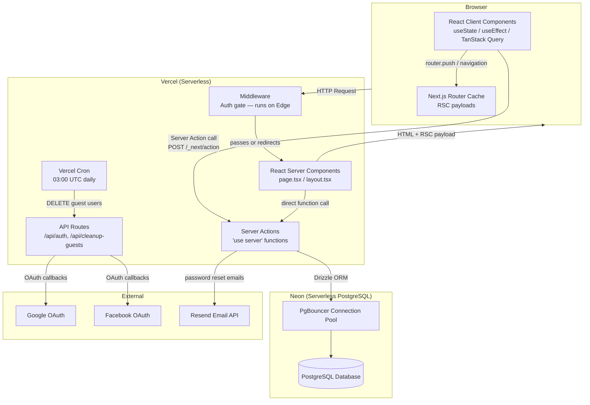

# TortugaIQ — Architecture Documentation

TortugaIQ is a personal knowledge management app built for long-term learning. Users create **Concepts** — named pieces of knowledge with a Minimum Viable Knowledge (MVK) summary, full notes, and references — and organize them into subjects, topics, and tags. It is a full-stack Next.js application: one repo, no separate backend.

---

## System Architecture (10,000-Foot View)



**Key insight:** There is no separate backend API server. Server Actions replace REST endpoints. The Next.js server IS the backend.

---

## Document Index

| # | Document | Question It Answers | Read First If... |
|---|----------|--------------------|--------------------|
| [01](./01-system-overview.md) | System Overview | What is this app? Why these tools? | You're starting fresh |
| [02](./02-nextjs-deep-dive.md) | Next.js Deep Dive | How does Next.js work? Server vs Client? | You know React but not Next.js |
| [03](./03-database-and-orm.md) | Database & ORM | How is data stored? What are all the tables? | You're touching data or schema |
| [04](./04-authentication.md) | Authentication | How do users log in? How does the session work? | You're touching auth or sessions |
| [05](./05-server-actions.md) | Server Actions | Where does the server-side logic live? | You're adding or modifying data mutations |
| [06](./06-client-data-layer.md) | Client Data Layer | How does the UI get and update data? | You're working on any UI feature |
| [07](./07-state-and-providers.md) | State & Providers | How does cross-component state work? | You're modifying navigation or modals |
| [08](./08-views-and-components.md) | Views & Components | What does each screen do? What components exist? | You're building or modifying UI |
| [09](./09-security.md) | Security | What protects user data? What are the gaps? | You're reviewing risk or adding sensitive features |
| [10](./10-deployment.md) | Deployment | How does this get to production? | You're deploying or changing infrastructure |

---

## Recommended Reading Order

**New to the codebase:**
01 → 02 → 03 → 04 → 05 → 06 → 07 → 08

**Working on a specific feature:**
- UI changes: 08 → 06 → 07
- Data model change: 03 → 05 → 06
- Auth change: 04 → 09
- Deploy / infra: 10 → 09

**Interview prep:**
01 → 02 → 04 → 05 → 06 → 09

---

## Source Tree Quick Reference

```
src/
├── app/                    # Next.js App Router (pages, layouts, API routes)
│   ├── (app)/              # Protected app views — require auth
│   ├── (auth)/             # Sign-in, sign-up, password reset
│   ├── (marketing)/        # Public blog + privacy page
│   └── api/                # REST-style endpoints (NextAuth + cron only)
├── actions/                # Server Actions — all data mutations live here
├── auth.ts                 # NextAuth v5 configuration
├── middleware.ts            # Route protection (runs on Vercel Edge)
├── components/
│   ├── providers/          # React context providers
│   ├── ui/                 # Reusable UI components
│   └── landing/            # Marketing page components
├── hooks/                  # TanStack Query hooks (client-side data layer)
├── db/
│   ├── schema.ts           # Drizzle ORM table definitions (source of truth)
│   ├── index.ts            # DB client initialization
│   └── migrations/         # SQL migration files (committed to git)
└── lib/
    ├── types.ts            # TypeScript interfaces
    ├── validations.ts      # Zod schemas
    ├── md-config.tsx       # Markdown rendering configuration
    └── subject-colors.ts   # Deterministic subject color assignment
```
