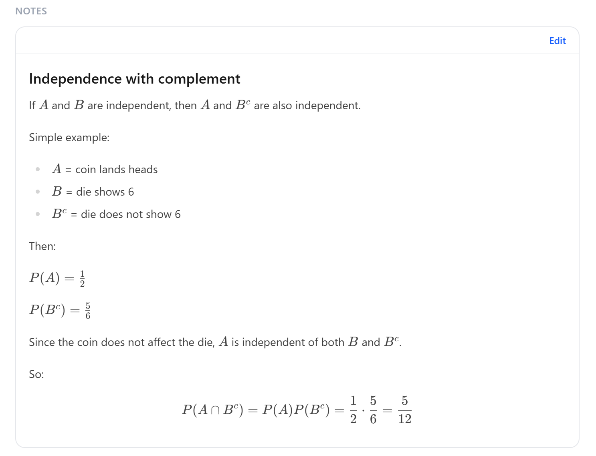

# Learning Probability with TortugaIQ — On Storing Intuition

### Familiarity over memorization

- In our experience, memorization strategies do not scale well for **long-term learning**.
- As the amount of knowledge increases, it becomes very difficult to rehearse or maintain specific pieces of memorized information.
- Well-known study techniques such as retrieval practice may work at a small scale, but become much harder to sustain at a large scale.
- Instead, we want a system that helps us build **familiarity** with concepts and ideas.
- Our brains do not work like modern hard drives or databases.
- Rather, our brains work by forming mental **representations** (or impressions), though these fade quickly if they are not revisited.
- A long-term learning system should help us create, revisit, develop, and maintain these mental representations.
- More specifically, when it comes to long-term learning, it is better to build familiarity with a broad range of concepts and their representations than to depend solely on the precise memorization of material.

### Intuition over integration

- Traditional learning tends to focus too much on **integration**.
- For example, we often hear that _you do not know something unless you can teach it_.
- Or that you are supposed to be able to solve a complex problem on the spot.
- Or that you are supposed to be able to write an essay on a particular topic on the spot.
- In other words, you are supposed to perform like an expert.
- But in reality, integration usually requires explicit, careful preparation, and rehearsal.
- What's worse, integration does not guarantee long-term retention.
- From the long-term learning perspective, the brain may forget integrated knowledge just as quickly as it forgets isolated concepts.
- Our brains do not work like modern AI systems that can quickly scan large amounts of data and produce a highly integrated response on the spot.
- But our brains can form **intuitions** that are hard to define explicitly, and that can be developed gradually over time.
- The stronger our intuition for a subject, the easier it becomes to work through integration-type problems when needed.
- A long-term learning system should be able to help us develop these intuitions.
- I have found it very helpful to use AI to generate simple, intuitive examples, and then store them in the _Notes_ section of specific _Concepts_.
- Textbook-style examples are often unnecessarily complex, take a long time to review, and may be less effective for developing lasting intuition, even when they are fully understood.
- AI-generated examples can be much simpler, more concise, and more intuitive, and can often be reviewed in under a minute while still providing a similar level of understanding and a more lasting intuition for the concept.

### Familiarity + Intuition = Long-term Learning

- We are not against integration. Integration is the main purpose of learning: you want to be able to use knowledge in meaningful ways.
- But if learning is based on integration alone, then we are, relatively speaking, optimizing for the short term.
- From the long-term learning perspective, it is better to develop a strong **familiarity** with, and **intuition** for, an entire subject (even if you fail the exam) than to focus on getting an A in the class and then stop thinking about it.

### Storing intuition inside a Concept

In TortugaIQ, a _Concept_ can store not only a definition or representation, but also a short intuitive example in its _Notes_ section.

In the screenshot below, the experiment is simple: flip a coin and roll a die.

We define:

- $A$ = the event that the coin lands heads
- $B$ = the event that the die shows 6
- $B^c$ = the **complement** of $B$, meaning the event that $B$ does **not** happen
- so in this case, $B^c$ means the die shows 1, 2, 3, 4, or 5

Here, $P(\cdot)$ means the **probability** that an event happens.

So:

- $P(A)$ means the probability that the coin lands heads
- $P(B^c)$ means the probability that the die does not show 6
- $P(A \cap B^c)$ means the probability that **both** events happen: the coin lands heads **and** the die does not show 6

The symbol $\cap$ means **intersection**, or the event where both conditions are true at the same time.

The intuition is simple:

- the coin does not affect the die
- so whether the die shows 6 is unrelated to whether the coin lands heads
- and whether the die does **not** show 6 is also unrelated to whether the coin lands heads

Since the coin and die do not affect each other, these events are independent.

That is why:

$$
P(A \cap B^c) = P(A)P(B^c)
$$

In words: the probability that both happen is the probability of the first event multiplied by the probability of the second event.

With this kind of example, our intuition for the concept improves, the concept becomes easier to retain, and even when both fade over time, the idea becomes much easier to recover later.

